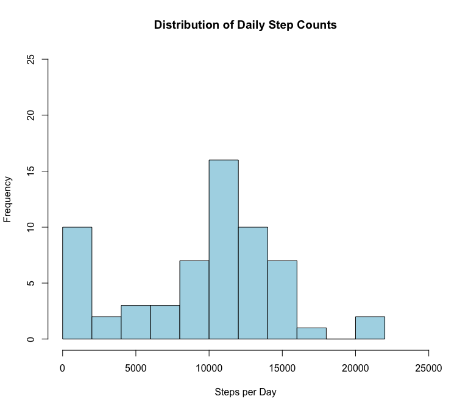
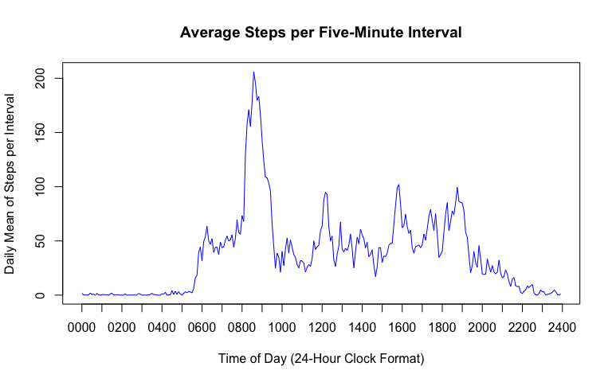
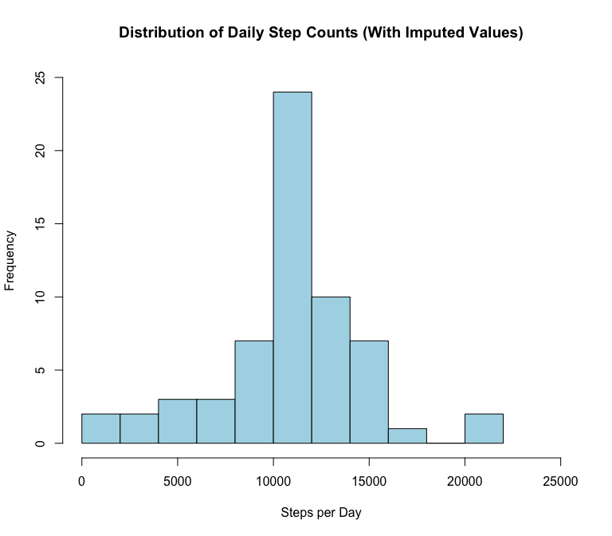
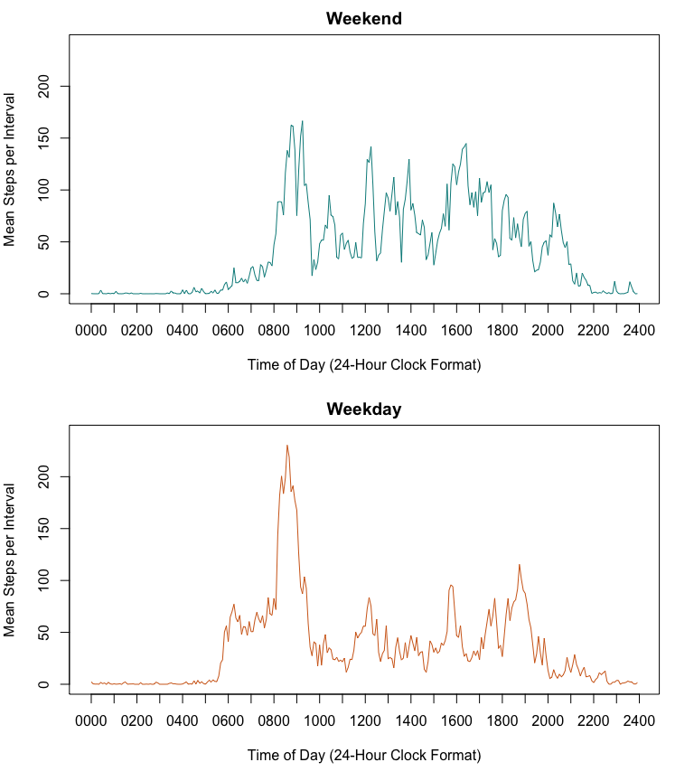

# Reproducible Research: Peer Assessment 1
  
Jeff Jetton  
  
<br><br>
  
### Loading and preprocessing the data
Store the activity data in a data frame called `data`. Default settings are sufficient.

```r
data <- read.csv("activity.csv")
```
  
The integer representing the interval is the 24-hour clock version of the time. This creates a "jump" of 45 units at the end of each hour. It will be useful to convert it to something more sequential, such as number of minutes past midnight:

```r
data$minutes <- (data$interval %/% 100) * 60 + (data$interval %% 100)
```
  
<br><br>  
  
### What is mean total number of steps taken per day?  
Calculate and store the sum total of steps for each date.  

```r
step.sums.by.date <- aggregate(data$steps, by=list(data$date), FUN=sum, na.rm=TRUE)
names(step.sums.by.date) <- c("date", "steps")
```

View daily step totals in a histogram.

```r
hist(step.sums.by.date$steps, breaks=15, col="lightblue",
     main="Distribution of Daily Step Counts",
     xlab="Steps per Day", xlim=c(0, 25000), ylim=c(0,25))
```

 

Calculate mean and median.

```r
mean(step.sums.by.date$steps, na.rm=TRUE)
```

```
## [1] 9354.23
```

```r
median(step.sums.by.date$steps, na.rm=TRUE)
```

```
## [1] 10395
```
  
<br><br>  
  
### What is the average daily activity pattern?
Calculate and store the mean, across all days, for each five-minute interval.  

```r
step.means.by.interval <- aggregate(data$steps, by=list(data$minutes), FUN=mean, na.rm=TRUE)
names(step.means.by.interval) <- c("minutes", "mean")
```
  
Plot the average daily pattern of steps per interval. Tick marks on the x-axis are every 12 intervals (i.e., every hour).

```r
# Draw plot using lines, without an x-axis
plot(step.means.by.interval$minutes, step.means.by.interval$mean,
		 type="l", main="Average Steps per Five-Minute Interval",
		 xlab="Time of Day (24-Hour Clock Format)", ylab="Daily Mean of Steps per Interval",
		 col="blue", xaxt="n")
# Add a custom x-axis to the plot...
# Ticks are every 60 minutes but are labeled in hours
axis(side=1, at=seq(0, 24*60, 60),
     labels=sprintf("%04d", seq(0, 2400, 100)))
```

 
  
Find the interval with the highest average steps.

```r
max.interval <- step.means.by.interval$minutes[
                    step.means.by.interval$mean==max(step.means.by.interval$mean)]
# Convert from "minutes since midnight" back into 24-hour format
sprintf("%04d", max.interval %/% 60 * 100 + max.interval %% 60)
```

```
## [1] "0835"
```
(8:35 in the morning)
  
<br><br>  
  
### Imputing missing values
How many rows have at least one NA in our data set? In what column(s) do they occur?

```r
sum(!complete.cases(data))
```

```
## [1] 2304
```

```r
summary(data)
```

```
##      steps                date          interval         minutes      
##  Min.   :  0.00   2012-10-01:  288   Min.   :   0.0   Min.   :   0.0  
##  1st Qu.:  0.00   2012-10-02:  288   1st Qu.: 588.8   1st Qu.: 358.8  
##  Median :  0.00   2012-10-03:  288   Median :1177.5   Median : 717.5  
##  Mean   : 37.38   2012-10-04:  288   Mean   :1177.5   Mean   : 717.5  
##  3rd Qu.: 12.00   2012-10-05:  288   3rd Qu.:1766.2   3rd Qu.:1076.2  
##  Max.   :806.00   2012-10-06:  288   Max.   :2355.0   Max.   :1435.0  
##  NA's   :2304     (Other)   :15840
```
Create a new copy of the data set, but replace the missing values with the average number of steps per day for that particular five-minute interval.

```r
data2 <- data
for (i in 1:nrow(data2)) {
    if (is.na(data2$steps[i])) {
        data2$steps[i] <- step.means.by.interval$mean[
        	                    step.means.by.interval$minutes==data2$minutes[i]]
    }
}
```
Create a histogram of the number of steps each day, using our new data set with imputed values.

```r
step.sums.by.date2 <- aggregate(data2$steps, by=list(data2$date), FUN=sum, na.rm=TRUE)
names(step.sums.by.date2) <- c("date", "steps")
hist(step.sums.by.date2$steps, breaks=15, col="lightblue",
     main="Distribution of Daily Step Counts (With Imputed Values)",
     xlab="Steps per Day", xlim=c(0, 25000), ylim=c(0, 25))
```

 
  
Calculate new mean and median.

```r
mean(step.sums.by.date2$steps)
```

```
## [1] 10766.19
```

```r
median(step.sums.by.date2$steps)
```

```
## [1] 10766.19
```
  
Calculate difference of mean and median from non-imputed data set.

```r
mean(step.sums.by.date$steps) - mean(step.sums.by.date2$steps)
```

```
## [1] -1411.959
```

```r
median(step.sums.by.date$steps) - median(step.sums.by.date2$steps)
```

```
## [1] -371.1887
```
  
Without the large number of nulls skewing the data, the mean and median have both increased. The lack of skew in the new data set is also shown by the equal mean and median.

  
<br><br>  
  
### Are there differences in activity patterns between weekdays and weekends?
Create a new factor variable indicating whether the particular day is a weekday or weekend. Use the data set with the imputed values.

```r
wkdays <- weekdays(strptime(data2$date, format="%Y-%m-%d"))
data2$day.type <- as.factor(ifelse(wkdays=="Saturday" | wkdays=="Sunday", "weekend", "weekday"))
```
Plot the average daily steps per interval for weekend days vs. weekdays.

```r
# Calculate interval averages separately
step.means.weekend <- aggregate(data2$steps[data2$day.type=="weekend"],
                                by=list(data2$minutes[data2$day.type=="weekend"]),
                                FUN=mean)
step.means.weekday <- aggregate(data2$steps[data2$day.type=="weekday"],
                                by=list(data2$minutes[data2$day.type=="weekday"]),
                                FUN=mean)

# We'll plot both plots stacked on top of each other, with matching axes
save.par <- par(mfrow=c(2,1), mar=c(5, 4, 2, 2))
ylim <- c(0, 240)
ylab <- "Mean Steps per Interval"
xlab <- "Time of Day (24-Hour Clock Format)"

# Draw weekend plot
plot(step.means.weekend[, 1], step.means.weekend[, 2],
		 type="l", main="Weekend",
             xlab=xlab, ylab=ylab, ylim=ylim,
		 col="darkcyan", xaxt="n")
axis(side=1, at=seq(0, 24*60, 60), labels=sprintf("%04d", seq(0, 2400, 100)))

# Draw weekday plot
plot(step.means.weekday[, 1], step.means.weekday[, 2],
		 type="l", main="Weekday",
		 xlab=xlab, ylab=ylab, ylim=ylim,
		 col="chocolate", xaxt="n")
axis(side=1, at=seq(0, 24*60, 60), labels=sprintf("%04d", seq(0, 2400, 100)))
```

 

```r
# Restore saved graphics paramters
par(save.par)
```
